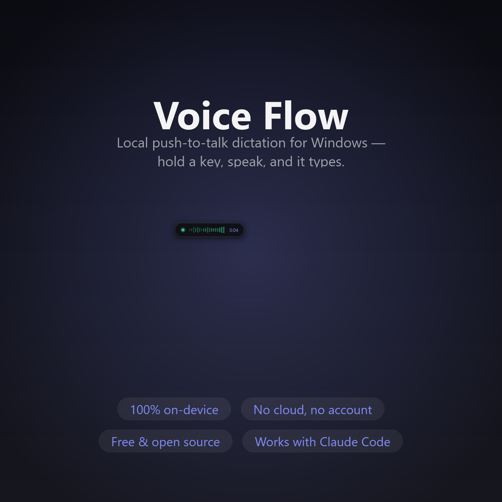
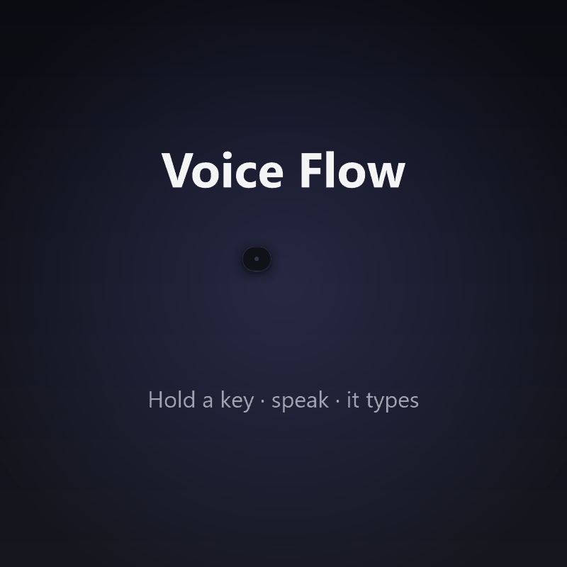
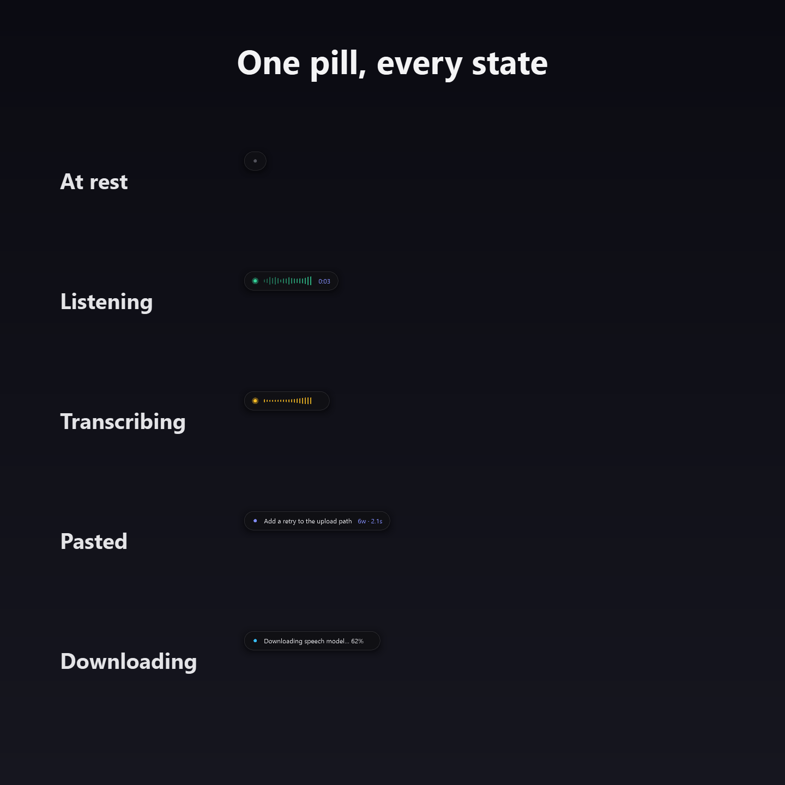
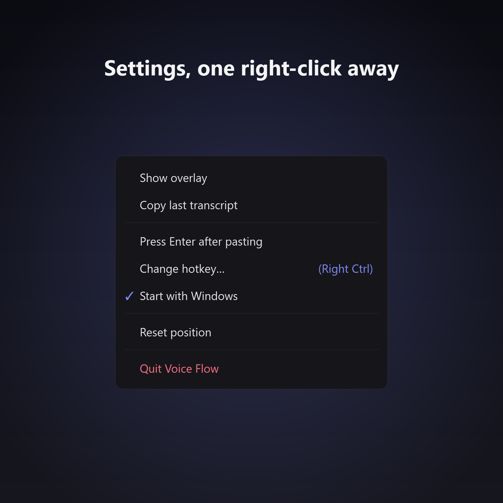

# Voice Flow

A tiny, local **push-to-talk dictation** overlay for Windows. Hold a key, speak,
and your words are typed into whatever field has focus — chat apps, editors, the
terminal, or an AI agent like Claude. Everything runs **on your machine**; no
audio ever leaves it.

Built as a free, open alternative to hosted dictation tools like Wispr Flow.



## Features

- **Push-to-talk** — hold **Right Ctrl**, speak, release. The text is pasted at
  your cursor.
- **Hands-free mode** — *tap* the hotkey instead of holding to latch; it stops
  on its own after a short silence, or tap again to finish.
- **Click-to-talk** — click the pill to start/stop, no hotkey needed.
- **A small, minimal pill** — sits quietly at rest, expands to show a live
  waveform only while you talk, then shrinks back.
- **Rebindable hotkey** — change it from the menu if Right Ctrl clashes.
- **Local & private** — transcription runs offline via
  [faster-whisper](https://github.com/SYSTRAN/faster-whisper) (`small.en`, CPU).
- **Runs on startup** (optional) and lives in the system tray.

## What it looks like

The overlay is a single pill that sits quietly at rest and expands to show a live
waveform, timer, and status only while you're talking.



Every state at a glance:



Right-click the pill (or the tray icon) for settings — rebind the hotkey, toggle
*Press Enter after pasting*, or *Start with Windows*.



## Download

Grab the latest **`VoiceFlow.exe`** from the
[Releases page](../../releases) — no Python required.

> **First launch:** the speech model (~460 MB) downloads once into
> `%LOCALAPPDATA%\VoiceFlow\models`; you'll see a progress bar. After that it
> starts instantly and works offline.

> **SmartScreen warning:** the `.exe` is unsigned (code-signing certificates
> cost money), so Windows may show *"Windows protected your PC."* Click
> **More info → Run anyway**. The source is right here if you'd rather build it
> yourself.

## Usage

| Action | How |
| --- | --- |
| Dictate | Hold **Right Ctrl**, speak, release |
| Hands-free | *Tap* Right Ctrl, speak, stop (auto-finishes on silence) |
| Start/stop by mouse | **Click** the pill |
| Cancel a recording | **Esc** |
| Quit from anywhere | **Esc Esc** (double-tap) |
| Move the pill | **Drag** it |
| Menu (settings) | **Right-click** the pill, or the tray icon |

From the menu you can change the hotkey, toggle *Press Enter after pasting*,
enable *Start with Windows*, and *Reset position* if the pill ends up off-screen.

## Run from source

```bash
python -m venv .venv
.venv\Scripts\activate
pip install -r requirements.txt
pythonw app.py      # pythonw = no console window
```

Python 3.10+ recommended. On a machine with an NVIDIA GPU + CUDA runtime,
the app will automatically use it; otherwise it falls back to CPU.

## Build the executable

```bash
pip install pyinstaller
pyinstaller VoiceFlow.spec
```

The build is **CPU-only** and does **not** bundle the model weights — it stays
small and fetches the model on first run. Output lands in `dist/VoiceFlow.exe`.
Attach that file to a GitHub Release (it's too large to commit to the repo).

## Project layout

```
app.py            The application (overlay, engine, hotkeys, tray)
VoiceFlow.spec    PyInstaller build spec
requirements.txt  Runtime dependencies
dev/              Early prototype + scratch smoke-tests (not part of the app)
```

## License

[MIT](LICENSE) © 2026 Youcef Missoum
 